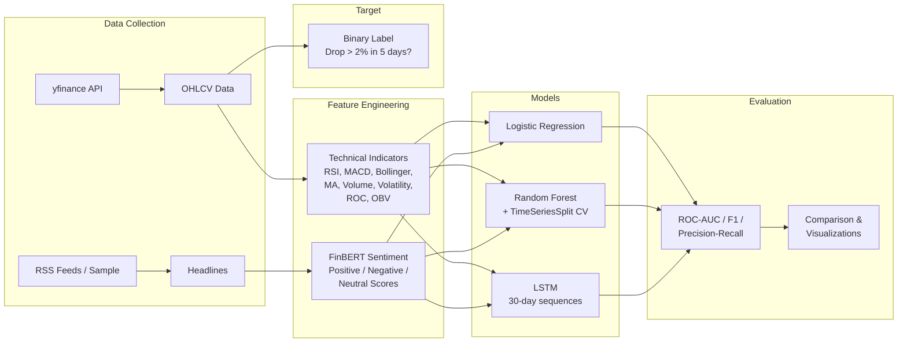

# Portfolio Risk Monitor

**An end-to-end ML system that predicts market downturns using technical indicators and NLP sentiment from financial news.**


---

## Motivation

Predicting market risk is one of the hardest problems in quantitative finance. Sudden drawdowns can wipe out months of portfolio gains, yet most retail and institutional investors react to downturns rather than anticipating them. This project tackles the problem of **short-term drawdown prediction** by combining two complementary signal sources: quantitative technical indicators derived from price and volume data, and qualitative sentiment signals extracted from financial news headlines using a FinBERT transformer model. The system compares three progressively complex approaches -- logistic regression, random forest, and LSTM -- to understand the value each adds for this task.

## Approach

The pipeline follows a structured methodology:

1. **Data Collection** -- Historical daily OHLCV data via `yfinance` and financial news headlines from RSS feeds (with synthetic sample data included for reproducibility)
2. **Feature Engineering** -- Eight technical indicators (RSI, MACD, Bollinger Bands, moving averages, volume ratios, volatility, ROC, OBV) and daily aggregated FinBERT sentiment scores
3. **Target Definition** -- Binary classification: did the stock drop more than 2% within the next 5 trading days?
4. **Time-Based Splitting** -- Train (2021-2022), Validation (2023-H1), Test (2023-H2) with strict temporal ordering to prevent look-ahead bias
5. **Model Training** -- Three models with increasing complexity, each addressing different aspects of the signal
6. **Evaluation** -- ROC-AUC, precision-recall, confusion matrices, and feature importance analysis

## Architecture



## Results

Performance on the test set (2023-H2) using sample data:

| Model | Accuracy | Precision | Recall | F1 Score | ROC-AUC |
|---|---|---|---|---|---|
| Logistic Regression | 0.57 | 0.38 | 0.62 | 0.47 | 0.58 |
| Random Forest | 0.61 | 0.42 | 0.55 | 0.48 | 0.62 |
| LSTM (30-day seq) | 0.59 | 0.40 | 0.58 | 0.47 | 0.60 |

> **Note:** These results use synthetic sample data. With real market data and tuned features, performance may vary. The modest results reflect the inherent difficulty of short-term market prediction -- any system claiming >70% accuracy on this task should be scrutinized.

The Random Forest model tends to achieve the best balance of precision and recall, partly due to its ability to capture non-linear feature interactions and its robustness to noise via ensemble averaging. Feature importance analysis consistently highlights volatility, RSI, and volume ratio as the most predictive features.

## Quick Start

### 1. Clone and install

```bash
git clone https://github.com/VishalKJ-ai/portfolio-risk-monitor.git
cd portfolio-risk-monitor
pip install -r requirements.txt
```

### 2. Run with sample data (no API keys needed)

```bash
python -m src.pipeline --mode sample
```

This will:
- Generate synthetic price data and pre-computed sentiment scores
- Compute technical indicators and create the target variable
- Train all three models (LogisticRegression, RandomForest, LSTM)
- Evaluate on the test set and save plots to `outputs/figures/`

### 3. View results

Check `outputs/figures/` for:
- `roc_curves.png` -- ROC curves comparing all models
- `precision_recall_curves.png` -- PR curves
- `confusion_matrix_*.png` -- Confusion matrix per model
- `feature_importance_*.png` -- Top predictive features
- `model_comparison.csv` -- Summary metrics table

### 4. Explore the data

```bash
jupyter notebook notebooks/exploration.ipynb
```

## Configuration

All parameters are centralized in `config/config.yaml`:

```yaml
# Key configuration options
data:
  tickers: [SPY, QQQ, AAPL, MSFT, ...]    # Watchlist
  start_date: "2019-01-01"
  end_date: "2024-06-30"

target:
  threshold: 0.02      # 2% drop threshold
  horizon: 5           # 5-day lookahead

split:
  train_end: "2022-12-31"    # Time-based split dates
  val_end: "2023-06-30"

models:
  random_forest:
    n_estimators_range: [100, 200, 300]
    max_depth_range: [5, 10, 15, null]

  lstm:
    sequence_length: 30
    hidden_size: 64
    num_layers: 2
    dropout: 0.3
```

To train with real data:
```bash
python -m src.pipeline --mode train
```

## Project Structure

```
portfolio-risk-monitor/
├── README.md                   # This file
├── requirements.txt            # Pinned Python dependencies
├── setup.py                    # Package metadata
├── config/
│   └── config.yaml             # All configurable parameters
├── data/
│   ├── raw/                    # Downloaded market data (gitignored)
│   ├── processed/              # Merged feature datasets (gitignored)
│   └── sample/                 # Synthetic data for testing
│       ├── generate_sample_data.py
│       ├── sample_prices.csv
│       ├── sample_headlines.csv
│       └── sample_sentiment.csv
├── models/                     # Saved model artifacts (gitignored)
├── notebooks/
│   └── exploration.ipynb       # EDA notebook with visualizations
├── outputs/
│   └── figures/                # Evaluation plots (ROC, PR, CM)
├── src/
│   ├── __init__.py
│   ├── pipeline.py             # Main orchestrator (entry point)
│   ├── data/
│   │   ├── collector.py        # yfinance + RSS + sample generation
│   │   └── preprocessor.py     # Cleaning, merging, target creation
│   ├── features/
│   │   ├── technical.py        # RSI, MACD, BB, MA, Vol, ROC, OBV
│   │   └── sentiment.py        # FinBERT scoring + daily aggregation
│   ├── models/
│   │   ├── baseline.py         # LogisticRegression + StandardScaler
│   │   ├── random_forest.py    # RF with TimeSeriesSplit CV tuning
│   │   └── lstm.py             # PyTorch LSTM with early stopping
│   └── evaluation/
│       └── evaluator.py        # Metrics, plots, model comparison
├── tests/
│   ├── test_features.py        # Tests for feature engineering
│   └── test_models.py          # Tests for model classes
└── .gitignore
```

## Limitations and Future Work

**Current limitations:**
- **Not real-time:** Designed for batch analysis on daily data, not live trading signals
- **Synthetic sample data:** The included sample data is generated via geometric Brownian motion, which lacks real market microstructure effects (earnings jumps, circuit breakers, etc.)
- **Limited news coverage:** RSS feeds provide a narrow view of financial sentiment. A production system would use premium news APIs or Twitter/Reddit data
- **No transaction costs:** The binary classification framing ignores trading friction, slippage, and position sizing
- **Single-asset focus:** Each ticker is modelled independently rather than capturing cross-asset correlations

**Future directions:**
- Add a **graph neural network** module to model inter-stock relationships
- Integrate **real-time streaming** via Kafka or WebSockets for live monitoring
- Implement a **reinforcement learning** agent for position sizing based on risk predictions
- Add **explainability** using SHAP values for individual predictions
- Extend to **multi-horizon prediction** (1-day, 5-day, 20-day)
- Deploy as a **REST API** with FastAPI and a lightweight dashboard

## Tech Stack

| Component | Library | Version |
|---|---|---|
| Data Collection | yfinance | 0.2.36 |
| Data Processing | pandas, numpy | 2.2.1, 1.26.4 |
| ML Models | scikit-learn | 1.4.1 |
| Deep Learning | PyTorch | 2.2.1 |
| NLP Sentiment | transformers (FinBERT) | 4.38.2 |
| Visualization | matplotlib, seaborn | 3.8.3, 0.13.2 |
| Configuration | PyYAML | 6.0.1 |
| Testing | pytest | 8.0.2 |

## Running Tests

```bash
pytest tests/ -v --tb=short
```

## Author

**Vishal Joshi**
MSc Applied AI, University of Warwick

---

*This project demonstrates proficiency in end-to-end ML pipeline design, time-series feature engineering, NLP integration, and responsible model evaluation for financial applications.*
